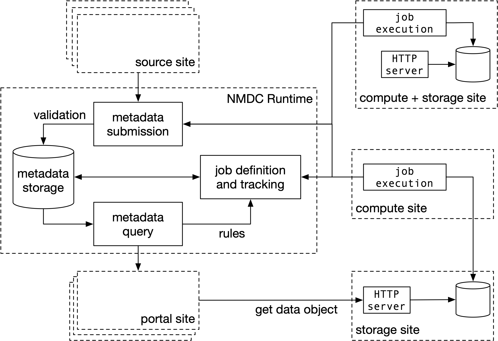

# Welcome

Welcome to the documentation for the NMDC Runtime.

# API Resource Diagram

```mermaid
erDiagram
    user }|--o{ site : administers
    site ||--o{ job-execution : claims
    job ||--o{ job-execution : done-via
    workflow ||--o{ job : configured-as
    site ||--o{ data-object : stewards
    nmdc-runtime-site ||--o{ job : creates
    job-execution ||--o{ data-object : has-output
    job-execution ||--o{ metadata : has-output
    nmdc-runtime-site ||--o{ metadata : ingests
```

<!-- Can relate to prov:Entity, prov:Activity, and prov:Agent -->

The above entity-relationship diagram shows various resources of the NMDC Runtime API.

A *site* is a resource, administered by one or more *users*, that may (1) steward *data objects*,
and (2) claim *job executions*.

The *NMDC Runtime* site is a special site that creates the *jobs* that sites can execute.
*Workflows* serve as the templates for these jobs -- specifically, the Runtime creates a job by
associating a workflow with a particular data object as its input.

Thus, each *job execution* is an application of a workflow to a particular input. The outputs of job
executions are data objects and *metadata*.

In the NMDC Schema, the term *data object* refers to a metadata record that includes a URL to access
a payload, the raw sequence of bytes that the data object identifies. Thus, "sites steward data
objects" means that sites ensure that data object metadata is accurate and actionable -- this
includes either directly hosting URLs for payloads, or else obtaining URLs from delegated services.

The NMDC Runtime site ingests metadata output by job executions. This ingestion may trigger the
creation of new workflow jobs for sites to claim and execute.

## Site Federation

<figure markdown>
  
  <figcaption>NMDC Runtime Site Federation</figcaption>
</figure>
